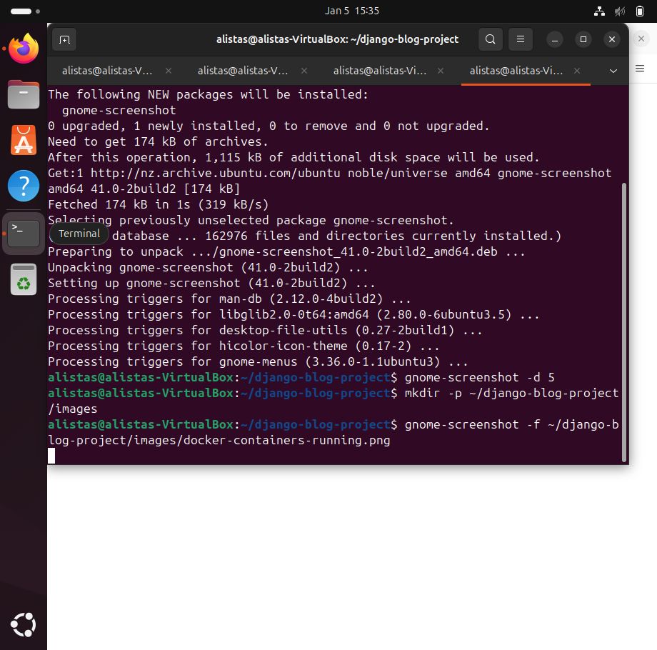

# Django Blog Project

## Sprint 2: Dockerizing the Django Application

### Objective
Containerize the Django application using Docker and prepare it for deployment on EC2.

### Results
Successfully Dockerized the Django application with MySQL database. The application runs in two containers:
- `web`: Django application served by Gunicorn
- `db`: MySQL 8.0 database

### Screenshots

#### 1. Docker Containers Running


#### 2. Django Application Homepage


#### 3. Database Connection Verified


### Key Accomplishments
- ✅ Docker and Docker Compose installed
- ✅ Created Dockerfile and docker-compose.yml
- ✅ Configured Django to use environment variables for database connection
- ✅ Set up MySQL container with proper health checks
- ✅ Applied Django migrations to create database tables
- ✅ Application accessible at http://localhost:8000
- ✅ Database connection successfully verified

### Commands Used
```bash
# Build and run containers
sudo docker compose up

# Apply Django migrations
sudo docker compose exec web python manage.py migrate

# Verify database connection
sudo docker compose exec web python manage.py shell
>>> from django.db import connection
>>> connection.ensure_connection()
>>> print("Connection successful!")

# View running containers
sudo docker ps
# django-blog-project
